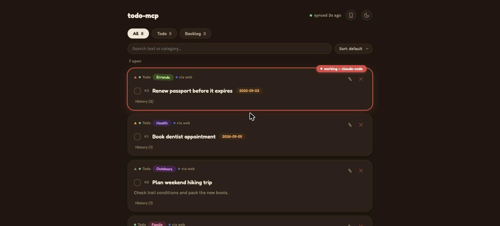
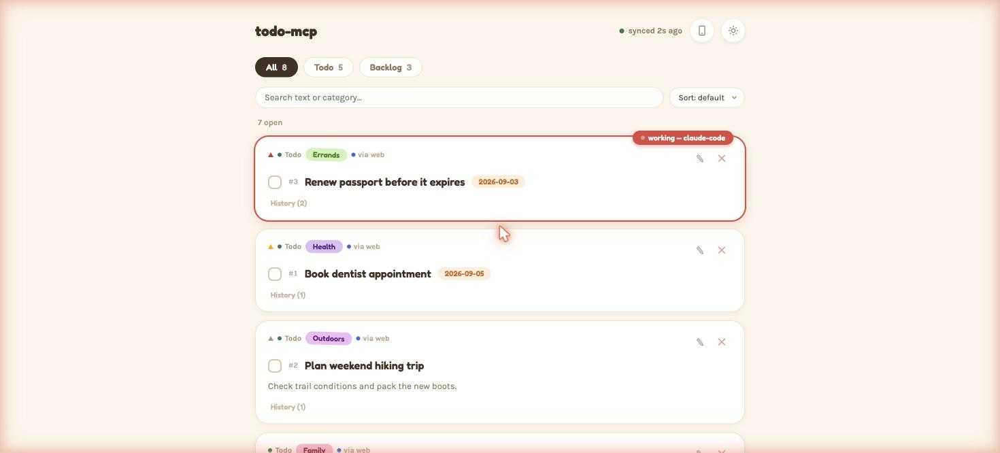

# Docket

[](https://www.npmjs.com/package/@pasichdev/docket)
[](https://github.com/pasichDev/docket/actions/workflows/ci.yml)
[](https://registry.modelcontextprotocol.io)
[](LICENSE)

**One list every AI tool you use can write to — Claude Code, Codex, Cursor,
Warp — across every project, before the work is worth a ticket. Local-first,
self-hostable, no SaaS account.**

A thought that shows up mid-session is worth capturing but not worth the
ceremony: a Notion template, a GitLab issue format, a ticket id you have to
invent. So today it evaporates. Docket is the layer underneath all of that —
work lands here at the speed an agent can type, from any tool, in any
project, and **graduates** to Notion/GitLab/Obsidian when it's earned it.

Nobody else occupies this space, and it isn't an accident: Anthropic will not
integrate Claude Code with Cursor, and Cursor will not integrate with Codex.
Every vendor optimises its own closed loop. The space *between* the tools is
structurally nobody's.

## One list, many projects

Docket files every item under the project it was captured in, automatically —
resolved from the git remote of wherever the agent is running. You never type
it, and no agent has to remember to.

```text
~/work/backend      claude-code, codex   ─┐
~/side/tracker      claude-code          ─┼──▶  docket  ──▶  one list, three scopes
~/side/notes        codex, warp          ─┘
```

- `todo_list` in `~/work/backend` shows **that project's** open items, not all
  three projects' — compact, one line each.
- The web dashboard has a workspace switcher with per-project open counts.
- Items with no project context land under **Unfiled** and stay visible, never
  guessed at.

Using the git *remote* rather than the path means the same repo cloned to
`~/src/backend` on a laptop and `/work/backend` on a desktop is **one**
workspace — which matters precisely because sync exists. Full resolution
order and the `.docket.json` override: **[`docs/workspaces.md`](docs/workspaces.md)**.

<p align="center">
  
  
</p>

## Quick start

**You need:** [Claude Code](https://claude.com/claude-code) (or another MCP host)
and Node.js 18+ (`node --version`; get it from [nodejs.org](https://nodejs.org)).

```sh
npx -y @pasichdev/docket setup          # one shared data dir, detected MCP hosts configured
claude mcp add docket -- npx -y @pasichdev/docket
```

Restart Claude Code and ask it *"add a todo: buy milk"*. The web dashboard is
at **http://localhost:8787** — it started itself the moment the first client
connected.

Optionally, to see what's open in a project when a session starts:

```sh
npm install -g @pasichdev/docket        # the hook runs a command, so it needs one on PATH
docket hook install                     # then: docket hook doctor
```

`hook install` works without the global install too — it pins the command to
this exact copy of docket and tells you it did — but the short form survives
moving or reinstalling, and `npx` leaves nothing on `PATH`.

Using Claude Desktop, Cursor, Windsurf, Zed, or Warp instead? Same MCP config
shape — see [Supported hosts](#supported-hosts).

## Upgrading from 2.x

**Read this before you upgrade if you have existing items.**

3.0 migrates your store from data format v7 to v8 on first run, automatically.
The migration itself is safe and is not the risk. **Downgrading afterwards
is.**

docket 2.3.1 writes the store from its own v7 shape: it has never heard of the
fields v8 adds, so its very first write after a reinstall **silently strips
them from every item**. Nothing errors, and a later re-upgrade hands out fresh
sequence numbers that no longer mean what your paired devices think they mean.
2.3.1 is published and cannot be patched, so 3.0 defends the only way it can —
by keeping a copy of your pre-migration store:

```text
~/.docket/todos.v7-pre-upgrade.enc
```

It is written once, before the first v8 write, and never overwritten. The
upgrade prints its path on the run that creates it.

**To go back to 2.x, restore it first:**

```sh
docket restore --from-v7                     # puts the v7 store back; moves the v8 one aside
npm install -g @pasichdev/docket@2.3.1
```

In that order. `restore --from-v7` deletes nothing — your v8 store is renamed
aside, so you can come forward again later.

If you would rather have a portable copy as well, `docket backup ./pre-v3.backup`
before upgrading gives you one that includes your identity and paired peers.

## Bridges, not replaces

Docket is deliberately not where work lives forever. It's where work lands
*first*, before anyone knows whether it deserves a ticket. Most of it doesn't
and gets closed by hand; the rest graduates.

`sourceUrl` is the bridge in both directions. Set it whenever an item maps to
something with a URL — a GitLab issue, a Notion page, an Obsidian
share link, a Slack thread, a GitHub PR — and the card carries a clickable
link straight back to it.

> *Why not just use GitHub Issues?* Because an issue costs a title you have to
> phrase for an audience, a repo you have to pick, and labels you have to
> maintain — and because your Cursor session can't write one for you while
> you're mid-thought in a different project. Docket costs one sentence, from
> whichever tool you already have open. When the item turns out to matter, it
> becomes an issue, and `sourceUrl` remembers where it went.

## Supported hosts

Any MCP host works — the tools are identical everywhere:

```json
{
  "mcpServers": {
    "docket": { "command": "npx", "args": ["-y", "@pasichdev/docket"] }
  }
}
```

| Host | Config file |
|---|---|
| Claude Code | `claude mcp add docket -- npx -y @pasichdev/docket` |
| Claude Desktop | `~/Library/Application Support/Claude/claude_desktop_config.json` (macOS) / `%APPDATA%\Claude\claude_desktop_config.json` (Windows) |
| Cursor | `.cursor/mcp.json` or Global MCP settings |
| Windsurf | `~/.codeium/windsurf/mcp_config.json` |
| Codex | `~/.codex/config.toml` (`mcp_servers`) |
| Zed | `~/.config/zed/settings.json` — uses `context_servers`, see below |

<details>
<summary>Zed's config shape is slightly different</summary>

```json
{
  "context_servers": {
    "docket": { "command": { "env": {}, "path": "npx", "args": ["-y", "@pasichdev/docket"] } }
  }
}
```
</details>

### The one hook

Claude Code additionally gets a **`SessionStart` hook**, and only that one:

```sh
docket hook install      # writes .claude/settings.json (--global for user-wide)
docket hook doctor       # proves it fires, and reports measured latency
docket hook uninstall    # removes only the entries docket owns
```

When a session starts it injects the items open **in that project** — compact,
at most 7, under 120 tokens. Nothing at all when the project has nothing open.
Its whole job is continuity: you come back to a terminal and the thread is
already there.

**Don't want it?** `export DOCKET_HOOKS=off` disables it immediately, without
editing any config or uninstalling anything. `docket hook doctor` measures the
real round trip and says so if it is slow enough to notice.

**It fails open, always.** Server not running, request timed out, malformed
response, `DOCKET_HOOKS=off` — every one of those exits 0 and prints nothing.
A tool that degrades your session when the tool itself is broken gets
uninstalled, at which point it helps nobody. `docket hook doctor` runs the
configured command for real and reports what a session would actually see, so
a hook that never fires is visible rather than merely silent.

No `PreToolUse`, no blocking, no other hosts — the hook's only job in this
release is continuity, not enforcement.

### Guidance for non-Claude-Code agents

The tools work everywhere; the *guidance* ships as a Claude Code plugin. For
any other agent, copy [`skills/docket/SKILL.md`](skills/docket/SKILL.md)
(everything below the `---` frontmatter) into whichever file your agent reads
— `AGENTS.md` for Codex, `.cursor/rules/docket.mdc` for Cursor,
`.windsurfrules` for Windsurf, `CLAUDE.md` for Claude Desktop, or Warp's
custom-instructions setting.

```sh
/plugin marketplace add pasichDev/docket
/plugin install docket@docket
```

## Tools

| Tool | Description |
|---|---|
| `todo_add(title, description?, list?, category?, priority?, dueDate?, sourceUrl?, workspace?)` | Capture an item. Filed under the current project automatically. |
| `todo_list(filter?, list?, category?, agent?, session?, inProgress?, workspace?, verbose?, limit?, offset?)` | Scoped to the current project and compact by default. `workspace:"*"` for everything. |
| `todo_edit(id, ...)` | Edit any subset of fields by id. Pass `""` to clear an optional field. |
| `todo_claim(id)` / `todo_release(id)` | Mark an item in progress, or drop the claim. Auto-expires after 15 minutes. |
| `todo_complete(id)` | Mark done (also clears any claim). |
| `todo_history(id)` | Full change log for one item. |
| `todo_delete(id)` | Permanently remove an item. |
| `todo_version()` / `todo_check_update()` | Data-format version; read-only npm version check. |

Full field and workflow reference: [`skills/docket/SKILL.md`](skills/docket/SKILL.md).

## CLI

```text
docket list [-w <project>] [--all]          What's open, scoped like the MCP default
docket workspaces                           Projects, with open counts and last activity
docket sessions                             Agent sessions open right now, and where
docket stats | export | import              Inspection and round-tripping
docket hook install | uninstall | doctor    Claude Code SessionStart hook
docket serve | pair | devices | status      Self-hosted server & devices
docket backend use <url> | localize         Switch deployment mode
docket backup <file> | restore <file>       Encrypted full-device backup
docket web                                  Ensure the Web UI is running
docket check-update | update                Version management
```

`docket help` prints the canonical, always-current list. Full reference:
**[`docs/cli.md`](docs/cli.md)**.

## Deployment modes

|  | Local Mode | Self-hosted Mode |
|---|---|---|
| **Default?** | Yes — zero config | Opt-in |
| **Where state lives** | This machine (`~/.docket`) | The Docket Server you run |
| **Setup** | `docket setup` | `docket setup`, choose "Self-hosted", or `docket pair <url>` |
| **Web UI** | Runs on this machine | Served by the Docket Server |
| **Multi-machine** | Optional [P2P sync](docs/p2p-sync.md) between your own devices | Every paired device talks to one server |
| **Claims** | **Advisory** — a claim can be taken over, and across P2P it can be up to one pull interval stale | **Atomic** — a racing claim gets a `409`, decided by one authority |
| **Good for** | A single machine, or a few you personally use | An always-on Raspberry Pi, mini PC, NAS, home server, or VPS |
| **If the connection drops** | N/A | Every read/write/claim fails clearly — never a silent local fallback |

Both modes install from the same package and expose the same MCP tools. Full
self-hosted setup and what it deliberately doesn't do:
**[`docs/self-hosting.md`](docs/self-hosting.md)**.

> **P2P sync is deprecated as of v3.0.** It still works, and nothing is
> removed in this release — but its 15-second pull interval means claims are
> advisory across it, so it cannot deliver an atomic guarantee. Self-hosted
> Mode is the supported multi-machine path. See
> [`docs/p2p-sync.md`](docs/p2p-sync.md).

## Web UI

A real-time read/write dashboard — `http://localhost:8787` by default in Local
Mode (override with `DOCKET_WEB_PORT`), or the Docket Server's own URL in
Self-hosted Mode. Workspace switcher with per-project open counts, an active-
sessions panel, light/dark theme, search, sort, inline edit, undo-delete,
responsive mobile layout.

In Local Mode it starts itself: the first MCP client to connect spawns it
detached in the background if nothing's listening yet. Updates push live over
Server-Sent Events (`/api/events`), no polling.

Opening it from another device on your LAN (phone, tablet) requires an
explicit **Viewer Gate** approval from the host machine first — see
[Security](#security).

## Security

Docket has **four separate threat models** (encrypted local storage, P2P sync,
the LAN Viewer Gate, and self-hosted client/server traffic) — a guarantee from
one does not apply to another. The basics:

- **At rest**: `todos.json.enc` and `history.json.enc` are AES-256-GCM
  encrypted with a locally generated key — protects against accidental
  exposure, not against someone with read access to your own user account.
- **P2P sync**: X25519 ECDH + HKDF-derived per-pair secrets, HMAC-signed
  requests with replay protection, AES-256-GCM encrypted responses.
- **LAN Viewer Gate**: any browser other than the host machine needs explicit
  human approval before it can open the dashboard; that local traffic itself
  is plain HTTP, not TLS (documented tradeoff, not an oversight).
- **Self-hosted mode**: per-device HMAC signatures with timestamp+nonce replay
  protection. The server is **not** end-to-end encrypted against its own
  operator.
- **Updates**: every release is published with Sigstore-backed npm provenance,
  verifiable with `npm audit signatures`.

Full threat model, exact primitives and limitations:
**[`docs/security.md`](docs/security.md)**.

## Data & encryption

Authoritative data lives on this machine (`~/.docket`) in Local Mode, or on
the Docket Server in Self-hosted Mode — either way on infrastructure you
control, never a hosted account.

- `todos.json.enc` — the store, AES-256-GCM encrypted
- `history.json.enc` — the full audit log, kept off the store's write path
- `key` — a locally generated 256-bit key, `chmod 600`
- `device.json` — this machine's id, name, and X25519 identity keypair
- `peers.json.enc` — paired P2P devices and their derived sync secrets
- `sessions.json` — which agent sessions are open right now (plain, local-only,
  never synced; it holds process metadata, not content)

Set `DOCKET_DATA_DIR` to relocate the directory; startup refuses to silently
split an existing store rather than guessing.

## Backup & updating

`docket backup <file>` bundles the whole data directory into one
password-protected file (AES-256-GCM, scrypt-derived key); `docket restore`
writes it back, renaming what's on disk aside rather than overwriting.

```sh
docket check-update   # read-only — reports current vs. latest
docket update         # checks, confirms, installs, self-tests, rolls back on failure
```

## Testing

```sh
npm test
```

Runs the full `node:test` suite — sync delivery and pagination, the
cross-process file lock under real contention, workspace resolution and
scoping, the session registry, agent-facing token budgets, and the hook's
fail-open behaviour.

## License

MIT — see [LICENSE](LICENSE).
